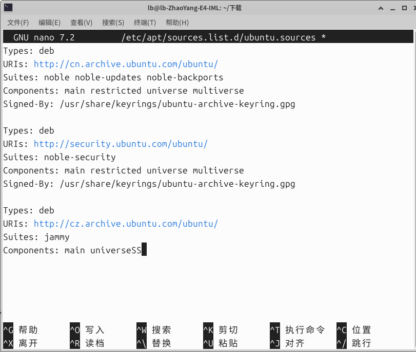
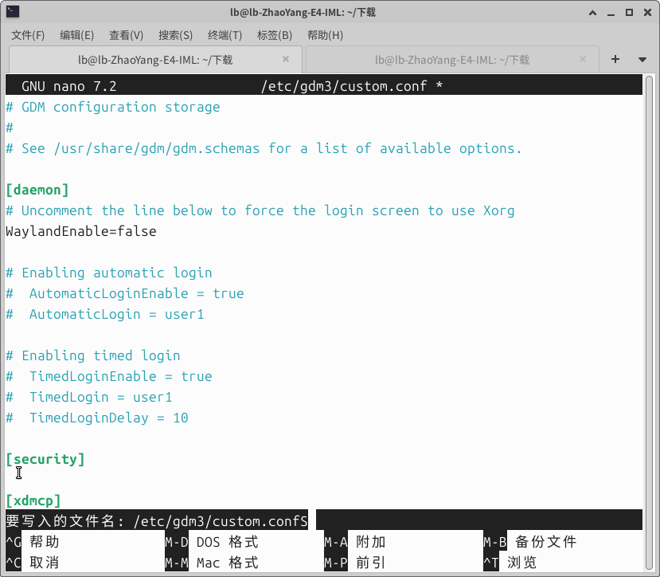

### ✅ 修正后完整配置（第三段已替换为 24.04 (noble) 版本）

deb822


```
# 官方中国镜像源（Ubuntu 24.04 noble）
Types: deb
URIs: http://cn.archive.ubuntu.com/ubuntu/
Suites: noble noble-updates noble-backports
Components: main restricted universe multiverse
Signed-By: /usr/share/keyrings/ubuntu-archive-keyring.gpg

# 官方安全更新源
Types: deb
URIs: http://security.ubuntu.com/ubuntu/
Suites: noble-security
Components: main restricted universe multiverse
Signed-By: /usr/share/keyrings/ubuntu-archive-keyring.gpg

# 修正后的第三段（原捷克jammy源替换为noble版本，删除多余SS）
Types: deb
URIs: http://cz.archive.ubuntu.com/ubuntu/
Suites: noble noble-updates noble-backports
Components: main restricted universe multiverse
Signed-By: /usr/share/keyrings/ubuntu-archive-keyring.gpg
```

------

### 📝 修改说明

1. **核心修正**：

   

   - 将原第三段的 `Suites: jammy`（22.04 版本）替换为 `noble noble-updates noble-backports`（24.04 版本），彻底解决跨版本混源问题
   - 删除了原 `Components` 行末尾多余的 `SS` 语法错误
   - 补全了 `restricted multiverse` 组件，与前两段保持一致，避免软件源缺失
   - 补充了 `Signed-By` 密钥验证字段，符合 Ubuntu 24.04 的 deb822 源规范

   

2. **操作步骤**：

   

   1. 在 nano 编辑器中，用方向键定位到第三段，按`Ctrl+K`剪切整段错误内容
   2. 粘贴上述修正后的第三段代码
   3. 按`Ctrl+O`写入，回车确认保存，`Ctrl+X`退出
   4. 执行`sudo apt update`验证源是否正常

   

------

### 💡 补充建议

捷克镜像站对国内用户访问速度较慢，若追求更快的更新速度，可将第三段的`URIs`替换为国内镜像（如阿里云 / 清华源），示例：

deb822


```
Types: deb
URIs: https://mirrors.aliyun.com/ubuntu/
Suites: noble noble-updates noble-backports
Components: main restricted universe multiverse
Signed-By: /usr/share/keyrings/ubuntu-archive-keyring.gpg
```


### 1. 先装好 libgconf（纯官方）

先在终端执行这 5 行（**一行一行复制**，别粘成一行）：

bash


运行


```
cd ~/下载

# 下载两个依赖（官方 archive）
wget http://archive.ubuntu.com/ubuntu/pool/universe/g/gconf/gconf2-common_3.2.6-7ubuntu2_all.deb
wget http://archive.ubuntu.com/ubuntu/pool/universe/g/gconf/libgconf-2-4_3.2.6-7ubuntu2_amd64.deb

# 安装
sudo dpkg -i gconf2-common_3.2.6-7ubuntu2_all.deb
sudo dpkg -i libgconf-2-4_3.2.6-7ubuntu2_amd64.deb

# 修复依赖
sudo apt -f install -y
```





# 1. 正确关闭 Wayland（向日葵必须）

复制这条命令直接执行：

```
sudo nano /etc/gdm3/custom.conf
```

打开后，找到这一行：

```
#WaylandEnable=false
```

**修改方法**：

1. 把前面的 `#` 删掉
2. 变成：

plaintext

```
WaylandEnable=false
```

1. 按 **Ctrl+O** → 回车保存
2. 按 **Ctrl+X** 退出

------

# 2. 重启电脑（必须）

bash


运行


```
sudo reboot
```

------

# 3. 重启后直接打开向日葵

bash


运行


```
sunloginclient
```

GUI：可以看到有图标了


（此为xfce桌面）
